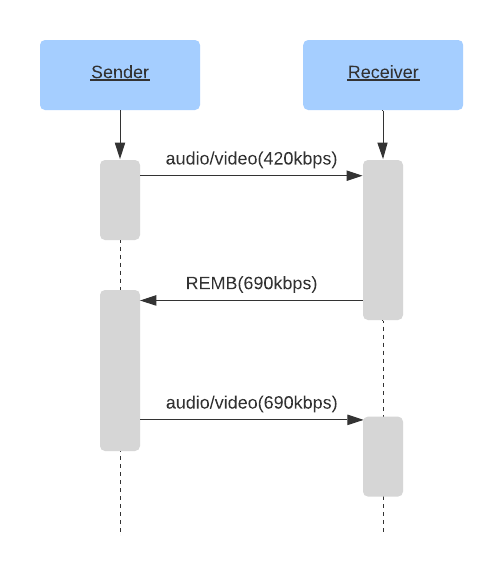
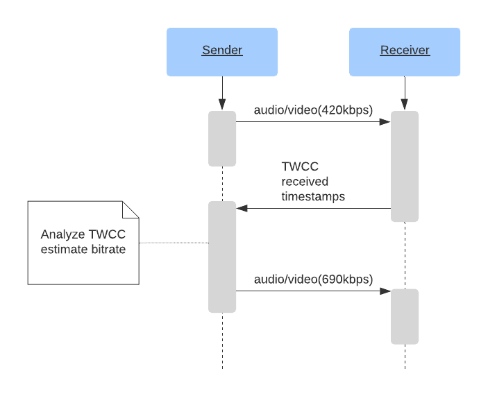
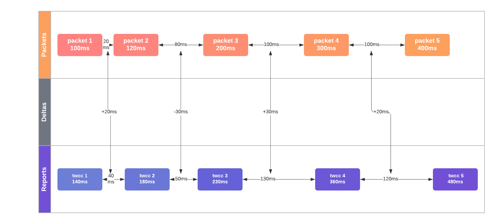

# What do I get from WebRTC's media communication?
WebRTC allows you to send and receive an unlimited amount of audio and video streams. You can add and remove these streams at anytime during a call. These streams could all be independent, or they could be bundled together! You could send a video feed of your desktop, and then include audio/video from your webcam.

The WebRTC protocol is codec agnostic. The underlying transport supports everything, even things that don't exist yet! However, the WebRTC Agent you are communicating with may not have the necessary tools to accept it.

WebRTC is also designed to handle dynamic network conditions. During a call your bandwidth might increase, or decrease. Maybe you all the sudden experience lots of packet loss. The protocol is designed to handle all of this. WebRTC responds to network conditions and tries to give you the best experience possible with the resources available.

## How does it work?
WebRTC uses two pre-existing protocols RTP and RTCP, both defined in [RFC 1889](https://tools.ietf.org/html/rfc1889)

RTP is the protocol that carries the media. It was designed to allow real-time delivery of video. It doesn't stipulate any rules around latency or reliability, but gives you the tools to implement them. RTP gives you streams, so you can run multiple media feeds over one connection. It also gives you the timing and ordering information you need to feed a media pipeline.

RTCP is the protocol that communicates metadata about the call. The format is flexible enough so you can add whatever you want. This is used to communicate statistics about the call. It is also necessary to handle packet loss and to implement congestion control. It gives you the bi-directional communication necessary to respond to network conditions changing.

## Latency vs Quality
Real-time media is about making trade-offs between latency and quality. The more latency you are willing to tolerate, the higher quality video you can expect.

### Real World Limitations
These constraints are all caused by the limitations of the real world. These are all characteristics of your network that you will need to overcome.

#### Bandwidth
Bandwidth is the maximum rate of data that can be transferred across a given path. It is important to remember this isn't a static number either. The bandwidth will change along the route as more (or less) people use it.

When you attempt to send more data then available bandwidth you will experience network congestion.

#### Transmission Time
Transmission Time is how long it takes for a packet to arrive. Like Bandwidth this isn't constant. The Transmission Time can fluctuate at anytime.

#### Jitter
Jitter is the fact that `Transmission Time` may vary. Some times you will see packets arrive in bursts. Any piece of hardware along the network path can introduce issues.

#### Packet Loss
Packet Loss is when messages are lost in transmission. The loss could be steady, or it could come in spikes. This isn't an uncommon occurrence either!

#### Maximum transmission unit
Maximum Transmission Unit is the limit on how large a single packet can be. Networks don't allow you to send one giant message. At the protocol level you need to packetize your data into small packets.

The MTU will also differ depending on what network path you take. You can use a protocol like [Path MTU Discovery](https://tools.ietf.org/html/rfc1191) to figure out what the largest packet size is you can send.

## Media 101
### Codec
### Frame Types

## RTP
### Packet Format
Every RTP packet has the following structure:

```
 0                   1                   2                   3
 0 1 2 3 4 5 6 7 8 9 0 1 2 3 4 5 6 7 8 9 0 1 2 3 4 5 6 7 8 9 0 1
+-+-+-+-+-+-+-+-+-+-+-+-+-+-+-+-+-+-+-+-+-+-+-+-+-+-+-+-+-+-+-+-+
|V=2|P|X|  CC   |M|     PT      |       Sequence Number         |
+-+-+-+-+-+-+-+-+-+-+-+-+-+-+-+-+-+-+-+-+-+-+-+-+-+-+-+-+-+-+-+-+
|                           Timestamp                           |
+-+-+-+-+-+-+-+-+-+-+-+-+-+-+-+-+-+-+-+-+-+-+-+-+-+-+-+-+-+-+-+-+
|           Synchronization Source (SSRC) identifier            |
+=+=+=+=+=+=+=+=+=+=+=+=+=+=+=+=+=+=+=+=+=+=+=+=+=+=+=+=+=+=+=+=+
|            Contributing Source (CSRC) identifiers             |
|                             ....                              |
+-+-+-+-+-+-+-+-+-+-+-+-+-+-+-+-+-+-+-+-+-+-+-+-+-+-+-+-+-+-+-+-+
|                            Payload                            |
+-+-+-+-+-+-+-+-+-+-+-+-+-+-+-+-+-+-+-+-+-+-+-+-+-+-+-+-+-+-+-+-+
```

#### Version (V)
`Version` is always 2

#### Padding (P)
`Padding` is a bool that controls if the payload has padding.

The last byte of the payload contains a count of how many padding bytes
were added.

#### Extension (X)
If set the RTP header will have extensions. This is described in greater detail below.

#### CSRC count (CC)
The amount of `CSRC` identifiers that follow after the `SSRC`, and before the payload.

#### Marker (M)
The marker bit has no pre-set meaning, and is up to the user.

It some cases it is set when a user is speaking. It is also commonly used to mark a keyframe.

#### Payload Type (PT)
`Payload Type` is the unique identifier for what codec is being carried by this packet.

For WebRTC the `Payload Type` is dynamic. VP8 in one call may be different then another. The Offerer in the call determines the mapping of `Payload Types` to codecs in the `Session Description`.

#### Sequence Number
`Sequence Number` is used for ordering packets in a stream. Every time a packet is sent the `Sequence Number` is incremented by one.

RTP is designed to be useful over lossy networks. This gives the receiver a way to detect when packets have been lost.

#### Timestamp
The sampling instant for this packet. This is not a global clock, but how much time has passed in the media stream.

#### Synchronization Source (SSRC)
A `SSRC` is the unique identifier for this stream. This allows you to run multiple streams of media over a single stream.

#### Contributing Source (CSRC)
A list that communicates what `SSRC`es contributed to this packet.

This is commonly used for talking indicators. Lets say server side you combined multiple audio feeds into a single RTP stream. You could then use this field to say 'Input stream A and C were talking at this moment'

### Extensions

### Mapping Payload Types to Codecs

## RTCP

### Packet Format
Every RTCP packet has the following structure:

```
 0                   1                   2                   3
 0 1 2 3 4 5 6 7 8 9 0 1 2 3 4 5 6 7 8 9 0 1 2 3 4 5 6 7 8 9 0 1
+-+-+-+-+-+-+-+-+-+-+-+-+-+-+-+-+-+-+-+-+-+-+-+-+-+-+-+-+-+-+-+-+
|V=2|P|    RC   |       PT      |             length            |
+-+-+-+-+-+-+-+-+-+-+-+-+-+-+-+-+-+-+-+-+-+-+-+-+-+-+-+-+-+-+-+-+
|                            Payload                            |
+-+-+-+-+-+-+-+-+-+-+-+-+-+-+-+-+-+-+-+-+-+-+-+-+-+-+-+-+-+-+-+-+
```

#### Version (V)
`Version` is always 2

#### Padding (P)
`Padding` is a bool that controls if the payload has padding.

The last byte of the payload contains a count of how many padding bytes
were added.

#### Reception Report Count (RC)
The number of reports in this packet. A single RTCP Packet can contain multiple events.

#### Packet Type (PT)
Unique Identifier for what type of RTCP Packet this is. A WebRTC Agent doesn't need to support all these types, and support between Agents can be different. These are the ones you may commonly see though.

* Full INTRA-frame Request (FIR) - `192`
* Negative ACKnowledgements (NACK) - `193`
* Sender Report - `200`
* Receiver Report - `201`
* Generic RTP Feedback - `205`

The significance of these packet types will be described in greater detail below.

### Full INTRA-frame Request
This RTCP message notifies the sender that it needs to send a full image. This is for when the encoder is giving you partial frames, but you aren't able to decode them.

This could happen because you had lots of packet loss, or maybe the decoder crashed.

### Negative ACKnowledgements
A NACK requests that a sender re-transmits a single RTP Packet. This is usually caused when a RTP Packet is lost, but could also happen because it is late.

NACKs are much more bandwidth efficent then requesting that the whole frame get sent again. Since RTP breaks up packets into very small chunks, you are really just requesting one small missing piece.

### Sender/Receiver Reports
These reports are used to send statistics between agents. This communicates the amount of packets actually received and jitter.

The reports could be used for general or diagnostics, or basic Congestion Control.

### Generic RTP Feedback

## How RTP/RTCP solve problems
RTP and RTCP then work together to solve all the problems caused by networks. These techniques are still constantly changing!

### Negative Acknowledgment
Also known as a NACK. This is one method of dealing with packet loss with RTP.

A NACK is a RTCP message sent back to a sender to request re-transmission. The receiver crafts a RTCP message with the SSRC and Sequence Number. If the sender does not have this RTP packet available to re-send it just ignores the message.

### Forward Error Correction
Also known as FEC. Another method of dealing with packet loss. FEC is when you send the same data multiple times, without it even being requested. This be done at the RTP level, or even lower with the codec.

If the packet loss for a call is steady this is much better then NACKs. The round trip of having to request, and then re-transmit the packet can be significant for NACKs.

### Adaptive bitrate and Bandwidth Estimation

A common problem of modern IP networks both wireless and wired is unpredictable and unreliable available bandwidth. Network conditions are changing dynamically multiple times throughout a session, it is not uncommon to see available bandwidth change drammatically (orders of magnitude) within a second.

Wired networks' intrinsics unpredictability is caused by changing demand for bandwidth shared across multiple users of the network, routing changes, limitations of transfer medium (fiber channel vs ethernet vs dsl) etc.
In addition to wired networks' issues the nature of radio signal transmission itself, interference from multiple sources, distance to cell tower or wifi access point and amount of physical obstacles (read walls) are among the reasons for unpredictable wireless network characteristics.

WebRTC has several mechanisms to help deliver video/audio signal to receiver despite changing network conditions.
The main idea is to adjust encoding bitrate based on predicted current and future available network bandwidth.
This ensures that video/audio signal of the best possible quality is transmitted and connection does not get dropped because of network congestion.
Heuristics that model the network behavior and try to predict it are known as Bandwidth estimation.

#### REMB

A widely supported albeit never fully standardized and now considered deprecated method is called [REMB](https://tools.ietf.org/html/draft-alvestrand-rmcat-remb-03) (Receiver Estimated Maximum Bitrate).
REMB is a special RTCP packet receiver sends to sender notifying the sender of available bandwidth. There's no(?) standard on the method used to estimate bandwidth associated with REMB, so the actual values are implementation dependent. Good starting point for research into details or REMB is [Chrome's source code](https://source.chromium.org/chromium/chromium/src/+/master:third_party/webrtc/modules/rtp_rtcp/source/rtcp_packet/remb.cc)

The only useful payload in the packet is the bitrate measured in bits per second.
Notable abiguity and source of confusion is that REMB is defined as _total_ bitrate while it is common to see webrtc libraries use it to constrain video encoding bitrate only.




### Congestion Control

Experienced WebRTC practitioners [say](https://gstconf.ubicast.tv/videos/google-transport-wide-congestion-control/) that REMB approach leaves scars, angry looks and even laughs from Google engineers.

Congestion Control is the act of adjusting the media depending on the attributes of the network. If you don't have a lot of bandwidth, you need to send lower quality video.

Congestion Control improves WebRTC experience by providing a more fine grained control and monitoring of network connection and conditions.


#### TWCC

Transport-Wide Congestion Control (TWCC) is an advanced congestion control specification implemented in most(?) browsers.

TWCC principle is quite simple:




Unlike REMB, TWCC receiver doesn't try to estimate it's own incoming bitrate, it lets sender know what packets where received and when. Based on the reports sender has a very up-to-date idea of what is happening on the network.

- Sender forms an RTP packet with a special TWCC header extension with packet sequence numbers
- Receiver responds with a special RTCP feedback message that notifies sender of when and if each packet was received

Sender keeps track of sent packets, their sequence numbers, sizes and timestamps.
When sender receives RTCP messages from receiver, sender compares send inter-packet delays with receive delays.
If receive delays increase it means network congestion is happenning and sender must act on it.

On the diagram below median interpacket delay increase is +20msec, a clear indicator of network congestion happening.




TWCC provides the raw data and an excellent view into real time network conditions:
- almost instant packet loss statistics, not only the percent lost but exact packets that were lost
- accurate send bitrate
- accurate receive bitrate
- jitter estimate
- differences of send and receive packet delays

To estimate receiver incoming bitrate on sender a trivial congestion control algrorithm may sum up packet sizes received and divide it by remote time elapsed.

More sophisticated congestion control algorithms like [A Google Congestion Control Algorithm for Real-Time Communication](https://tools.ietf.org/html/draft-alvestrand-rmcat-congestion-02) or GCC for short are built on top of TWCC raw data.
GCC was proposed by Google and implemented in Chrome.
It predicts current and future network bandwidth by using [Kalman filter](https://en.wikipedia.org/wiki/Kalman_filter).


There are several alternatives to GCC [NADA: A Unified Congestion Control Scheme for Real-Time Media](https://tools.ietf.org/html/draft-zhu-rmcat-nada-04) and [SCReAM - Self-Clocked Rate Adaptation for Multimedia](https://tools.ietf.org/html/draft-johansson-rmcat-scream-cc-05).


**Q**: How can I tell that twcc is supported and enabled?

**A**: Look at SDP offer/answer if you see the lines like below you have TWCC negotiated on your connection
```
a=extmap:5 http://www.ietf.org/id/draft-holmer-rmcat-transport-wide-cc-extensions
```
AND
```
a=rtcp-fb:96 transport-cc
```


### JitterBuffer
